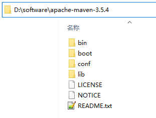

### 本资源由 itjc8.com 收集整理
[TOC]

# 第一节 Maven核心程序解压与配置

## 1、解压Maven核心程序

核心程序压缩包：apache-maven-3.5.4-bin.zip，解压到<span style="color:blue;font-weight:bold;">非中文、没有空格</span>的目录。例如：



在解压目录中，我们需要着重关注Maven的核心配置文件：conf/settings.xml


## 2、指定本地仓库

本地仓库默认值：用户家目录/.m2/repository。由于本地仓库的默认位置是在用户的家目录下，而家目录往往是在C盘，也就是系统盘。将来Maven仓库中jar包越来越多，仓库体积越来越大，可能会拖慢C盘运行速度，影响系统性能。所以建议将Maven的本地仓库放在其他盘符下。配置方式如下：

```xml
<!-- localRepository
| The path to the local repository maven will use to store artifacts.
|
| Default: ${user.home}/.m2/repository
<localRepository>/path/to/local/repo</localRepository>
-->
<localRepository>D:\maven-rep1026</localRepository>
```

本地仓库这个目录，我们手动创建一个空的目录即可。

<span style="color:blue;font-weight:bold;">记住</span>：一定要把localRepository标签<span style="color:blue;font-weight:bold;">从注释中拿出来</span>。

<span style="color:blue;font-weight:bold;">注意</span>：本地仓库本身也需要使用一个<span style="color:blue;font-weight:bold;">非中文、没有空格</span>的目录。


## 3、配置阿里云提供的镜像仓库

Maven下载jar包默认访问境外的中央仓库，速度很慢。改成阿里云提供的镜像仓库，访问国内网站，可以让Maven下载jar包的时候速度更快。配置的方式是：将下面mirror标签整体复制到mirrors标签的内部。

```xml
<mirrors>
	<mirror>
		<id>nexus-aliyun</id>
		<mirrorOf>central</mirrorOf>
		<name>Nexus aliyun</name>
		<url>http://maven.aliyun.com/nexus/content/groups/public</url>
	</mirror>
</mirrors>
```


## 4、配置Maven工程的基础JDK版本

如果按照默认配置运行，Java工程使用的JDK版本是1.5。配置的方式是：将profile标签整个复制到profiles标签内。

```xml
<profiles>
	<profile>
	  <id>jdk-1.8</id>
	  <activation>
		<activeByDefault>true</activeByDefault>
		<jdk>1.8</jdk>
	  </activation>
	  <properties>
		<maven.compiler.source>1.8</maven.compiler.source>
		<maven.compiler.target>1.8</maven.compiler.target>
		<maven.compiler.compilerVersion>1.8</maven.compiler.compilerVersion>
	  </properties>
	</profile>
</profiles>
```


[回目录](index.html) [下一节](verse02.html)